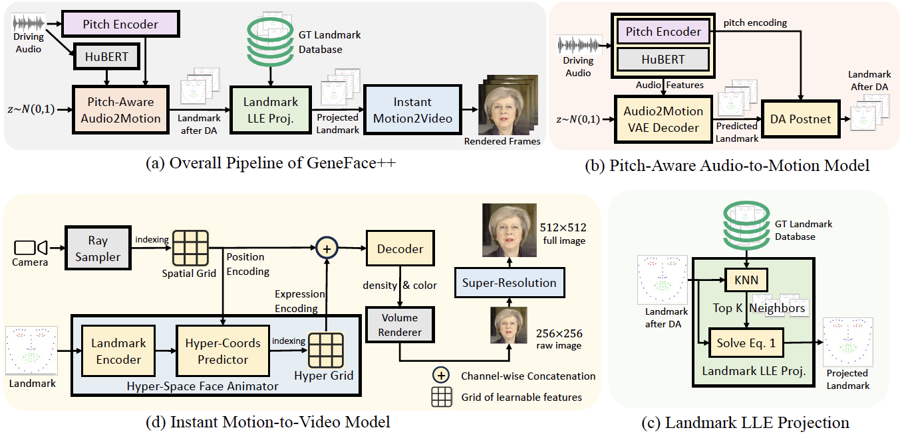

# GeneFace++: Generalized and Stable Real-Time 3D Talking Face Generation

[](https://arxiv.org/abs/2305.00787)| [](https://github.com/yerfor/GeneFacePlusPlus) | [中文文档](./README-zh.md)

This is the official implementation of GeneFace++ [Paper](https://arxiv.org/abs/2301.13430) with Pytorch, which enables high lip-sync, high video-reality and high system-efficiency 3D talking face generation. You can visit our [Demo Page](https://genefaceplusplus.github.io/) to watch demo videos and learn more details.

<p align="center">
    <br>
    
    <br>
</p>

## Setup In EC2

### Step 1: Install Necessary Updates and Packages
```bash
sudo apt-get update -y
sudo apt-get upgrade -y
sudo apt-get install -y zip unzip curl wget git
sudo apt install -y nvidia-driver-550
```

Reboot the instance after installing the NVIDIA driver.
```bash
sudo reboot
```

### Step 2: Install CUDA Toolkit
```bash
sudo apt install -y nvidia-cuda-toolkit
sudo apt-get install -y nvidia-container-toolkit
```

If facing error “Unable to locate package nvidia-container-toolkit”:
- Do this (if you are using Ubuntu 20.04):
```bash
distribution=$(. /etc/os-release;echo $ID$VERSION_ID)
curl -s -L https://nvidia.github.io/nvidia-docker/gpgkey | sudo apt-key add -
curl -s -L https://nvidia.github.io/nvidia-docker/$distribution/nvidia-docker.list | sudo tee /etc/apt/sources.list.d/nvidia-docker.list
sudo apt-get update && sudo apt-get install -y nvidia-container-toolkit
```

Else this (if you are using Ubuntu 22.04):
```bash
curl -fsSL https://nvidia.github.io/libnvidia-container/gpgkey | sudo gpg --dearmor -o /usr/share/keyrings/nvidia-container-toolkit-keyring.gpg
curl -s -L https://nvidia.github.io/libnvidia-container/stable/deb/nvidia-container-toolkit.list | sed 's#deb https://#deb [signed-by=/usr/share/keyrings/nvidia-container-toolkit-keyring.gpg] https://#g' | sudo tee /etc/apt/sources.list.d/nvidia-container-toolkit.list
sudo apt-get update && sudo apt-get install -y nvidia-container-toolkit 
```

### Step 3: Install Docker
```bash
sudo apt-get install -y docker.io
sudo systemctl start docker
sudo systemctl enable docker
sudo usermod -aG docker $USER
```

Reboot the instance after adding the user to the docker group.
```bash
sudo reboot
```

### Step 4: Clone the Repository
```bash
git clone https://github.com/yerfor/GeneFacePlusPlus.git
cd GeneFacePlusPlus
```

### Step 5: Build the Docker Image
```bash
docker pull nvidia/cuda:11.8.0-cudnn8-devel-ubuntu22.04
docker build -t ubuntu22.04-cu118-conda:torch2.0.1-py39 -f Dockerfile.cu118.torch2.0.1.py39   .
docker build -t geneface:latest -f Dockerfile.genface .
```

### Step 6: Prepare the Files
**Download 3DMM Files into deep_3drecib/BFM**
```bash
cd deep_3drecon/BFM
python3 download_bfm.py
cd ../../
```

**Download the Pre-processed Dataset of May**
```bash
mkdir -p data/binary/videos/May/
cd data/binary/videos/May/
gdown 16fNJz5MbOMqHYHxcK_nPP4EPBXWjugR0
cd ../../../../
```

**Download the Pre-trained Audio2Motion (Generic) and Motion2Video (For May) Weights**
```bash
mkdir -p checkpoints
cd checkpoints
mkdir audio2motion_vae
cd audio2motion_vae
gdown 1Qg5V-1-IyEgAOxb2PbBjHpYkizuy6njf
gdown 1bKY5rn3vcAkv-2m1mui0qr4Fs38jEmy-
cd ..
gdown 1O5C1vK4yqguOhgRQ7kmYqa3-E8q5H_65
unzip motion2video_nerf.zip
rm motion2video_nerf.zip
cd ..
```


### Step 7: Start a Docker Container
```bash
docker run -it --name geneface -p 7859:7860 --gpus all -v ~/.cache:/root/.cache -v ~/GeneFacePlusPlus:/GeneFacePlusPlus/  geneface:latest /bin/bash
```

### Step 8: Activate the Inference Environment
```bash
source ~/.bashrc
conda activate pytorch
cd /GeneFacePlusPlus/
export PYTHONPATH=./
export HF_ENDPOINT=https://hf-mirror.com
```

### Step 9: Run the Inference Script
```bash
python inference/genefacepp_infer.py --a2m_ckpt=checkpoints/audio2motion_vae --head_ckpt=checkpoints/motion2video_nerf/${VIDEO_ID}_head --torso_ckpt='' --drv_aud=data/raw/val_wavs/Obama_audio_10s.wav --out_name=output_${VIDEO_ID}.mp4
```

Now you can quit the docker container at any time.

### To restart the Docker Container and the Inference Environment
```bash
docker start geneface
docker exec -it geneface /bin/bash
conda activate pytorch
cd /GeneFacePlusPlus/
export PYTHONPATH=./
export HF_ENDPOINT=https://hf-mirror.com
```


## Train GeneFace++ with your own videos
Suppose a training video is named `VIDEO_ID.mp4`, you can execute the script `prepare_training_data.sh` to finish all the steps in one run. 
<!-- ```bash
bash run.sh ${VIDEO_ID}
``` -->
```bash
bash prepare_training_data.sh
```

- Set `VIDEO_ID` as per the name of your video
- It should take approximately ~1 hour to finish all the processing for a 5-minute video
- The processed data will be saved in `data/binary/videos/${VIDEO_ID}/` and `data/processed/videos/${VIDEO_ID}/`
- ALREADY INCLUDED in above `prepare_training_data.sh` script: Copy a config folder `egs/datasets/{Video_ID}` following `egs/datasets/Custom`
    - Make sure to change the ```video_id``` in ```lm3d_radnerf_torso.yaml``` and ```lm3d_radnerf.yaml``` from ```Custom``` to your ```VIDEO_ID```
    - Make sure to change the ```head_model_dir``` in ```lm3d_radnerf_torso.yaml``` as per your ```VIDEO_ID```
- Use the command lines below to train the NeRF models

Train the NeRF model:
```bash
CUDA_VISIBLE_DEVICES=0 python tasks/run.py --config=egs/datasets/${VIDEO_ID}/lm3d_radnerf_sr.yaml --exp_name=motion2video_nerf/${VIDEO_ID}_head --reset
```

- The training process will take approximately 20 hours for each person on an A10 GPU

## Inference with the trained model
### For 
* First, activate the inference environment:
```bash
cd /workspace/GeneFacePlusPlus/ && conda activate pytorch && export PYTHONPATH=./ && export VIDEO_ID="X"
```

* Run the inference script with the following command:
```bash
python inference/genefacepp_infer.py --a2m_ckpt=checkpoints/audio2motion_vae --head_ckpt=checkpoints/motion2video_nerf/${VIDEO_ID}_head/ --torso_ckpt='' --drv_aud=data/raw/val_wavs/Obama_audio_10s.wav --out_name=Result_${VIDEO_ID}_head/output_${VIDEO_ID}.mp4
```

### For Half-Body/Full-Body
* Paste the above generated video file on the top of original video
```bash
python3 paste_back.py -i1 original_video_path, -i2 generated_video_path, -c coordinates_path, -o output_video_path
```

## Citation
GeneFace++ Paper:
```
@article{ye2023geneface++,
  title={GeneFace++: Generalized and Stable Real-Time Audio-Driven 3D Talking Face Generation},
  author={Ye, Zhenhui and He, Jinzheng and Jiang, Ziyue and Huang, Rongjie and Huang, Jiawei and Liu, Jinglin and Ren, Yi and Yin, Xiang and Ma, Zejun and Zhao, Zhou},
  journal={arXiv preprint arXiv:2305.00787},
  year={2023}
}
```